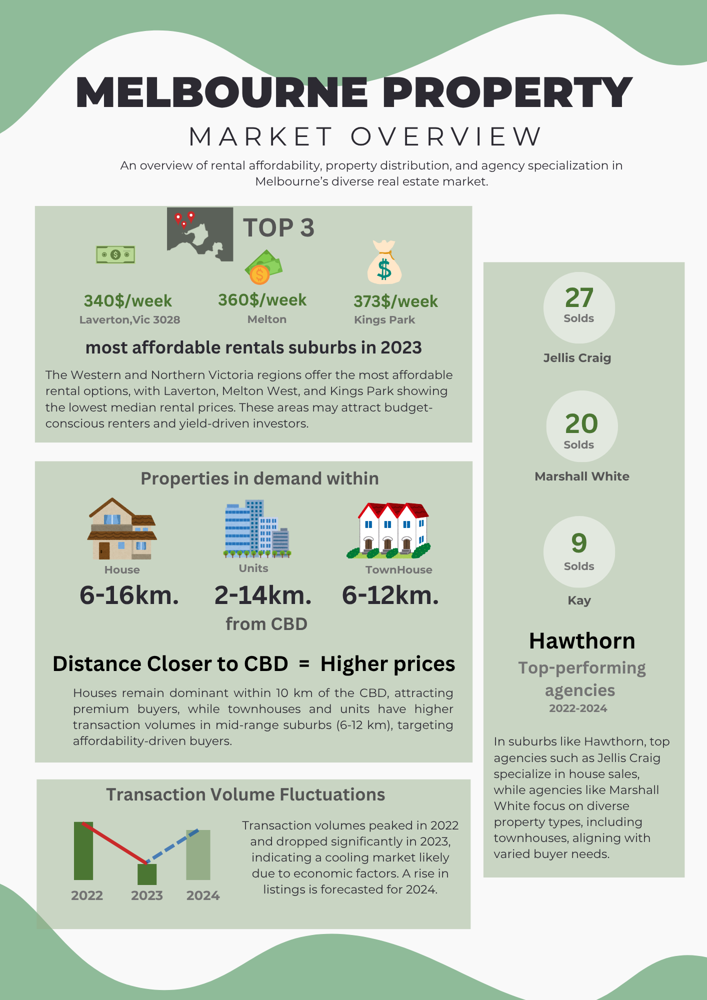
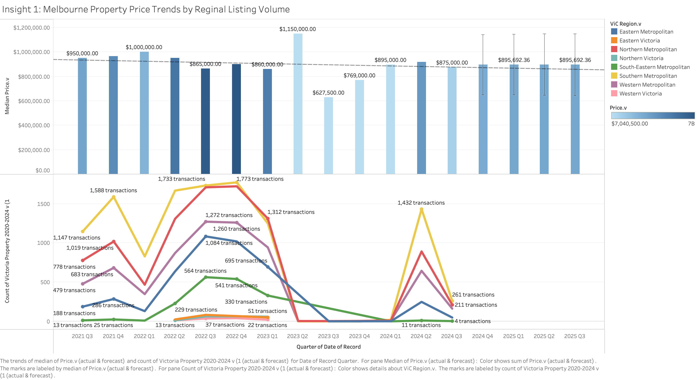
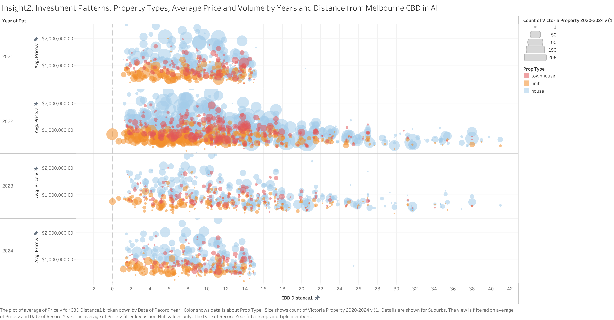
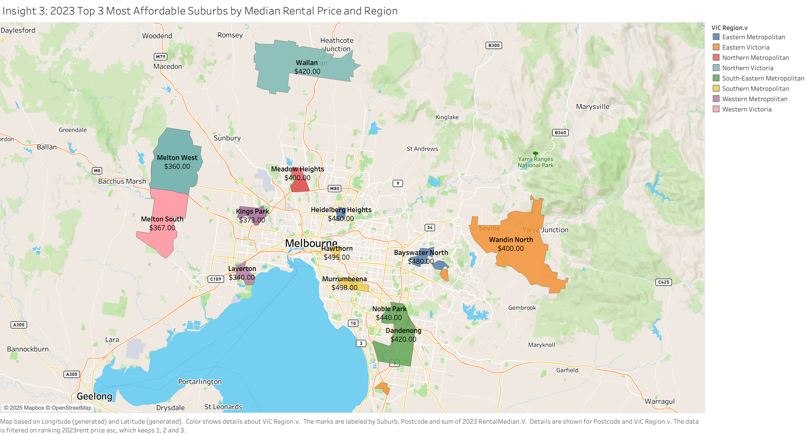
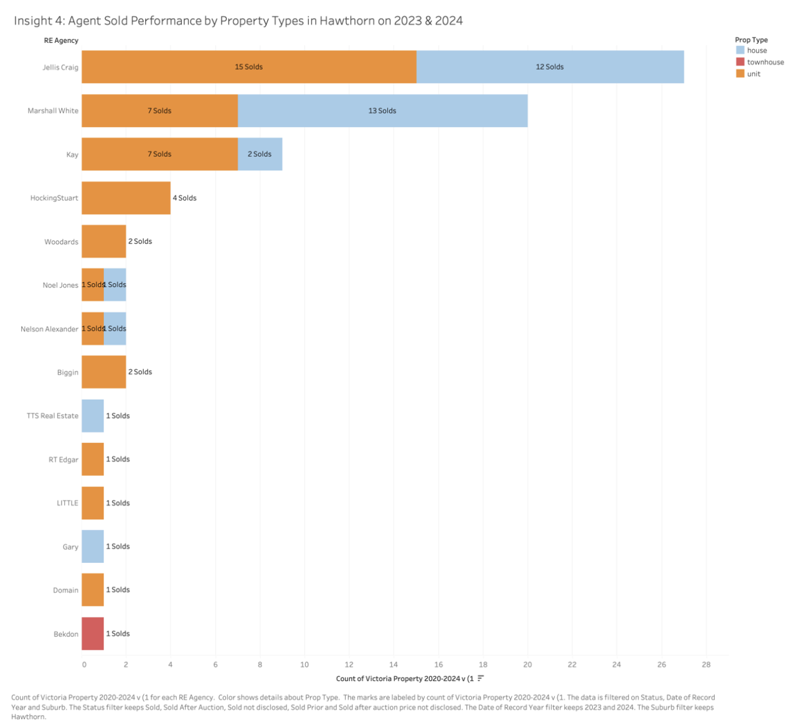
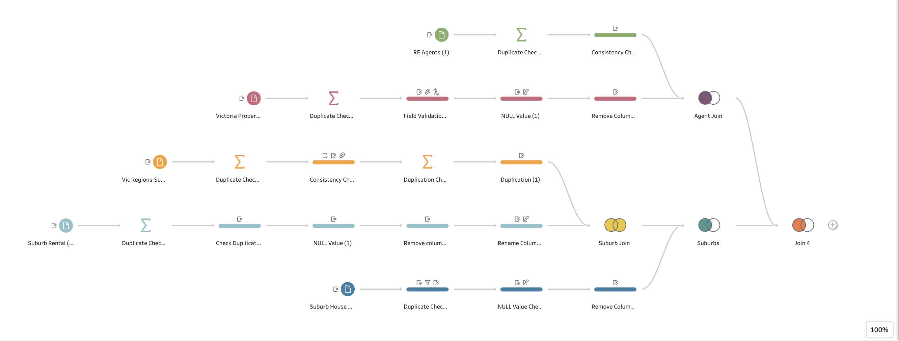

# Melbourne Property Analysis – Data-Driven Case Study  
**INF20016 – Big Data Management, Swinburne University**  
*By Chonnikarn Yuthchana (Student ID: 103801015)*

---

## 👋 Introduction

### Problem Statement

The Melbourne property market is at a crossroads, marked by conflicting forecasts and uncertainty about future trends. Investors, particularly those who have accumulated funds during and after the pandemic, face a dynamic real estate landscape filled with volatility, speculation about market corrections, and uncertainty driven by economic and policy changes. These investors are seeking rigorous, data-driven analysis to confidently allocate their resources, manage long-term risks, and maximise their returns in an environment with no clear consensus on market direction.

Key questions faced by stakeholders include:
- **Will Melbourne's property market continue to grow, or is a correction imminent?**
- **Which suburbs and property types are most resilient to market fluctuations?**
- **How do economic, policy, and demographic factors influence investment outcomes?**
- **Where are the best opportunities for capital growth or stable rental yields?**

### Stakeholders

The primary stakeholders for this project are:
- **Investor Group (Clients of Melbourne Property Insights, MPI):**  
  Sophisticated, risk-aware investors ready to deploy capital into Melbourne’s property market, seeking evidence-based guidance for their investment strategies.
- **Property Analysts & Consultants (MPI Team):**  
  Responsible for delivering robust, actionable insights derived from rigorous data analysis, and ensuring recommendations are grounded in data quality and academic research.
- **Homeowners and Prospective Buyers:**  
  Interested in understanding property value trends and making informed buying decisions.
- **General Public and Policymakers:**  
  Indirectly benefit from improved transparency and understanding of property market drivers.

### Project Approach & Requirement Gathering

To meet stakeholder needs and address the complex challenges of the Melbourne property market, the following steps were undertaken:

1. **Understanding Client Concerns & Objectives**  
   During the initial requirement-gathering phase, I engaged with the investor group (the project client) to identify their critical concerns—market volatility, location attractiveness, investment resilience, and risk mitigation. I translated these needs into a focused set of analysis questions and deliverables.

2. **Data Acquisition & Validation**  
   Curated a comprehensive dataset from trusted sources (Consumer Affairs Victoria, Domain.com.au, government open data) to ensure a reliable foundation for analysis. Initial data profiling was performed to assess completeness, consistency, and integrity.

3. **Requirement Specification**  
   Established project deliverables based on stakeholder expectations:
   - Rigorous data quality assessment
   - Insights tailored to investor needs (e.g., location comparison, rental yields, market trends)
   - Visual reporting through Tableau dashboards and an infographic
   - A detailed, professional report including critical data-driven insights and actionable recommendations

4. **Analysis Planning**  
   Developed a plan to address the following core questions:
   - What is the current state and likely direction of the Melbourne property market?
   - Which regions and property types present the best opportunities and lowest risks?
   - How have market dynamics changed post-pandemic, and what factors drive these trends?
   - How can data analytics provide an edge over traditional intuition-based investing?

5. **Continuous Feedback & Refinement**  
   Throughout the process, I solicited feedback from stakeholders to refine analysis focus and visualizations, ensuring alignment with client objectives and the assignment’s academic standards.

### Project Deliverables

- **Comprehensive Data Quality Assessment** to ensure reliable insights and highlight any limitations in the data.
- **Critical Investment Insights** supported by compelling Tableau dashboards, identifying high-yield suburbs, resilient property types, and agency performance.
- **Professional Report & Infographic** summarizing key findings, methodology, and actionable recommendations for investors.
- **Interactive Tableau Workbook** providing a hands-on exploration of the Melbourne property market data and trends.

**By addressing these objectives and following a transparent, stakeholder-driven process, this project empowers investors to make well-informed decisions and navigate Melbourne’s real estate market with clarity and confidence.**

---

## 📊 Project Overview

This project delivers a comprehensive, data-driven analysis of Melbourne’s real estate market, designed to inform property investors and stakeholders. The work was conducted as part of the INF20016 Big Data Management unit (Year 3, Semester 1) at Swinburne University.

**Key outcomes:**
- Cleaned and prepared property data using Tableau Prep Builder
- Built interactive Tableau dashboards to visualize market trends and opportunities
- Generated actionable insights for property investment decisions
- Produced a professional report covering methodology, data quality, and recommendations

---

## 🚀 Repo Structure & Files

| File/Folder                                        | Description                                      |
|----------------------------------------------------|--------------------------------------------------|
| `report/INF20016Case_Study_Analysis_Report.pdf`    | Full case study analysis report (PDF)             |
| `data/CleanedDataSubmit103801015.tflx`             | Cleaned data in Tableau Prep Builder format       |
| `tableau/AnalysisPackange103801015.twbx`           | Tableau dashboard workbook (all visualizations)   |
| `assets/images/`                                   | Dashboard screenshots, infographics, visuals      |

---

## 🏆 Project Highlights

- **Rental Affordability:** Premium suburbs near the CBD (e.g., Hawthorn, Hughesdale) command high rental prices, while outer suburbs like Laverton and Melton West are more affordable—creating diverse investment opportunities.
- **Location & Property Type Trends:** Proximity to the CBD strongly influences property values and demand; houses dominate within 10km, while units and townhouses offer affordable options slightly further out.
- **Agency Specialization:** Suburb-level analysis (e.g., Hawthorn) reveals which real estate agencies excel in selling specific property types, helping investors choose effective partners.
- **Regional Rental Trends:** Western and Northern suburbs cluster affordable rentals; Southern and Eastern suburbs demand higher rents due to central amenities and access.

---

## 📈 Visual Insights

  
*2023’s top affordable suburbs for renters and investors.*

**Insight 1: Melbourne Market Overview**  
*Median property prices have shown relative stability from 2021–2024, with strong transaction volumes in Southern, Northern, and Western Metropolitan regions, indicating sustained demand and potential resilience to market fluctuations.*

**Insight 2: Investment Patterns by Distance from CBD**  
*Investment trends reveal that houses dominate within 10 km of the CBD and attract the highest prices, while units and townhouses are more common (and affordable) in mid-range suburbs, enabling different strategies for growth and yield.*

**Insight 3: Affordable Suburbs for Renters & Investors**  
*The most affordable rental suburbs in 2023—such as Laverton, Melton West, and Kings Park—are concentrated in Western and Northern Melbourne, providing value opportunities for cost-conscious renters and high-yield potential for investors.*

**Insight 4: Agency Performance and Specialization in Hawthorn**  
*In Hawthorn, agency specialization is clear: Jellis Craig leads in house sales, while Marshall White and Kay & Burton excel in townhouse transactions. This specialization highlights the importance of aligning with agencies that have proven expertise in the property type of interest—maximizing sales and investment outcomes in a highly competitive suburb.*

---

## 📥 How to Use This Repository

1. **Read the Report:**  
   See [`report/INF20016Case_Study_Analysis_Report.pdf`](report/INF20016Case_Study_Analysis_Report.pdf) for project background, data quality assessment, methodology, findings, and references.

2. **Explore the Data:**  
   Open [`data/CleanedDataSubmit103801015.tflx`](data/CleanedDataSubmit103801015.tflx) in Tableau Prep Builder to see the data wrangling and cleaning steps.

3. **Interact with Dashboards:**  
   Download [`tableau/AnalysisPackange103801015.twbx`](tableau/AnalysisPackange103801015.twbx) and open it in Tableau Desktop or Tableau Public to explore the dashboards and insights.

---

## 🌐 Live Demo

> [View Live Tableau Dashboard](https://public.tableau.com/views/MelbournePropertyAnalysis/MelbourneRealEstateInvestmentInsightsDashboard?:language=en-US&:sid=&:redirect=auth&publish=yes&showOnboarding=true&:display_count=n&:origin=viz_share_link)

---

## 📑 Executive Summary

This project analyzed the Melbourne real estate market to provide strategic, data-driven guidance for property investors:

- Evaluated rental affordability and identified high-yield, budget-friendly suburbs
- Assessed the impact of location and property type on investment returns
- Examined real estate agency specialization at the suburb level
- Conducted a rigorous data quality assessment to ensure reliable analysis

**Key takeaway:**  
Melbourne’s property market offers a variety of investment strategies, balancing affordability, growth, and risk, with specific opportunities driven by suburb location, property type, and agency expertise.

---

## 🧹 Data Quality & Cleaning (Methodology Summary)

- Resolved missing values using calculated market medians for each year
- Removed duplicates and standardized property types and region assignments
- Validated and corrected suburb names and postcodes
- Documented all cleaning steps in the report’s appendix for transparency

---

## 🧹 Data Cleaning Workflow

Ensuring the accuracy and reliability of property market insights requires robust data cleaning and preparation.  
The following visual summarizes my data wrangling process using Tableau Prep:

**Key Steps in the Cleaning Process:**
- Duplicate checking and removal across all tables
- Handling NULL values with imputation (e.g., using median values)
- Consistency checks (e.g., region, suburb names, property types)
- Data validation (e.g., correcting misspellings, verifying postcodes)
- Field standardization and final table joins for analysis

See the [full report](report/INF20016Case_Study_Analysis_Report.pdf) for detailed methodology.

## 👩‍💻 About the Analyst

**Chonnikarn Yuthchana**  
Final-year Computer Science student (Business Analytics co-major)  
Swinburne University of Technology  
[LinkedIn](https://www.linkedin.com/in/chonnikarnyuth/) | [Tableau Public](https://public.tableau.com/views/MelbournePropertyAnalysis/MelbourneRealEstateInvestmentInsightsDashboard?:language=en-US&:sid=&:redirect=auth&publish=yes&showOnboarding=true&:display_count=n&:origin=viz_share_link)

---

## 📚 References

- Consumer Affairs Victoria, Domain.com.au, Realestate.com.au, government datasets  
- Full reference list in the [report](report/INF20016Case_Study_Analysis_Report.pdf)

---

## 📫 Contact

For questions or collaboration, connect with me on [LinkedIn](https://www.linkedin.com/in/chonnikarnyuth/).

- [GitHub Repository](https://github.com/your-username/melbourne-property-analysis)
- [Tableau Public Dashboard](https://public.tableau.com/views/MelbournePropertyAnalysis/MelbourneRealEstateInvestmentInsightsDashboard?:language=en-US&:sid=&:redirect=auth&publish=yes&showOnboarding=true&:display_count=n&:origin=viz_share_link)